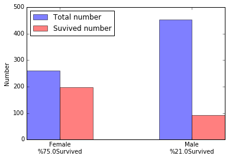

# 泰坦尼克号数据分析

## 1.导入函数库和数据集


```python
import pandas as pd
import numpy as np
import matplotlib.pyplot as plt
from pandas import DataFrame
from pandas import Series

```


```python
%matplotlib inline  
```


```python
data = pd.read_csv('titanic_data.csv', index_col=0)#用乘客的编号作为索引
```

## 2.提出问题和猜想

### 影响乘客生存率的因素有哪些？
#### 猜测影响因素：性别、年龄、父母/姐妹数、乘坐费用

## 3.数据预处理

### 数据预处理主要包括以下三点：
1.删除不需要的列

2.对含有缺失值的行进行删除或者填充

3.对内容相似的列进行合并

4.对数据进行适当分组

### 过程
1.查看数据列名，可以发现，乘客的名字、舱号（缺失值较多）、船票号、出发港口和生存率没有直接的联系，可以直接删去使数据更简洁：


```python
data.columns
```


    Index([u'Survived', u'Pclass', u'Name', u'Sex', u'Age', u'SibSp', u'Parch',
           u'Ticket', u'Fare', u'Cabin', u'Embarked'],
          dtype='object')


```python
#通过drop函数删除对应的列
data.drop(['Cabin', 'Embarked', 'Name', 'Ticket'], axis=1, inplace=True)
```

2.通过查看数据缺失值情况，可以发现，数据集中仅年龄含有缺失值且项较少，因此选择直接删除缺失值：


```python
#data.isnull().sum()
data.info()
#年龄包含177个
```

    <class 'pandas.core.frame.DataFrame'>
    Int64Index: 891 entries, 1 to 891
    Data columns (total 7 columns):
    Survived    891 non-null int64
    Pclass      891 non-null int64
    Sex         891 non-null object
    Age         714 non-null float64
    SibSp       891 non-null int64
    Parch       891 non-null int64
    Fare        891 non-null float64
    dtypes: float64(2), int64(4), object(1)
    memory usage: 55.7+ KB
    


```python
data.dropna(axis=0, how='any', inplace=True)
data.isnull().sum()
#删除了数据集中所有的缺失值
```


    Survived    0
    Pclass      0
    Sex         0
    Age         0
    SibSp       0
    Parch       0
    Fare        0
    dtype: int64


3.进一步观察数据可知，父母数中含有大量0值，不便于数据分析，考虑到父母/子女/配偶/姐妹在分析中的作用相似，可以相加合并为一个变量“亲属数”。


```python
data['rel'] = data['SibSp'] + data['Parch']
```

4.根据分析的目的，可以事先根据乘客的生还状况分组，定义两个数据集data_s和data_n表示乘客的生存状况（survived/not survived），便于分析数据。


```python
data_n = data[data['Survived'] == 0]
data_s = data[data['Survived'] == 1]
```

## 4.数据描述性分析和可视化分析

### 1.目的：通过描述性分析和可视化分析，比较生还组和非生还组的组间差异，直观展示影响乘客生还率的因素

### 2.过程

#### 数据可视化

** 1.对船票这一（近似的）连续变量，分组进行箱线图比较，展示相关性，构建函数增强复用性 **


```python
#箱线图的相关处理
def boxFigure(axe, var):#参数：图表和变量
    bplot = axe.boxplot([data_n[var], data_s[var]], vert=True, patch_artist=True)
    plt.setp(axe, xticks=[1, 2], xticklabels=['Not_Survived', 'Survived'])
    colors = ['lightblue', 'lightgreen']
    for patch, color in zip(bplot['boxes'], colors):
        patch.set_facecolor(color)
    for label in (axe.get_xticklabels() + axe.get_yticklabels()):
        label.set_fontname('Arial')
        label.set_fontsize(15)
    axe.set_ylabel(var, size=15)
    return axe

fig, axe = plt.subplots(figsize=(9, 7))
axe = boxFigure(axe, 'Fare')
#由于Survived组含有一个费用>500的异常值，因此选择忽略，缩小y轴范围使图表更加清晰
axe.set_ylim([0,300])
for label in (axe.get_xticklabels() + axe.get_yticklabels()):
    label.set_fontname('Arial')
    label.set_fontsize(15)

    
```


分析：箱线图清晰展示了票价对生还状况分组别的影响：在基于票价的分组箱线图中，生还组的票价无论是在均值、25%分位数、中位数还是75%分位数上，都明显高于非生还组，显示出了较强的相关性；


** 2.对年龄分段编码，绘制柱状图比较年龄分段的生还状况。**


```python
pd.options.mode.chained_assignment = None#参考stackoverflow对添加新列时产生错误的解决方法
def map_f(age, n, m):
    group = [x for x in range(0,m*n,m)]
    for i in range(0, len(group)):
        if age >= group[i] and age < group[i+1]:
            return '[' + str(group[i]) + ',' + str(group[i+1]) + ')'
#返回对应分段的字符串

#为数据集添加新列：
group = data['Age'].apply(map_f, args=(10, 10))
data['age_group'] = group
group_s = data_s['Age'].apply(map_f, args=(10, 10))
data_s['age_group'] = group_s
group_n = data_n['Age'].apply(map_f, args=(10, 10))
data_n['age_group'] = group_n
```


```python
#由于生还组和非生还组的样本数量不同，因此可以通过年龄段占总人数比例的方式展示年龄对生还率的影响
#生还组年龄比例
#s_rate = data_s.groupby('age_group').size() / data_s['age_group'].count()
#非生还组年龄比例
#n_rate = data_n.groupby('age_group').size() / data_n['age_group'].count()
#整体年龄比例
#rate = data.groupby('age_group').size() / data['age_group'].count()
#生还组年龄分段索引（用于绘图）
#s_index = np.arange(len(data_s.groupby('age_group').size())) * 1.5
#非生还组年龄分段索引
#n_index = np.arange(len(data_n.groupby('age_group').size())) * 1.5
#整体年龄分段索引
#total_index = np.arange(len(data.groupby('age_group').size())) * 1.5
#for index_s in s_rate.index:
#   for index_n in n_rate.index:
#        if index_s not in n_rate.index:
#           n_rate = n_rate.append(Series(0,index=[index_s])).sort_index()
#        if index_n not in s_rate.index:
#            s_rate = s_rate.append(Series(0, index=[index_n])).sort_index()
#生还组年龄分段索引（用于绘图）
#s_index = np.arange(len(s_rate.index)) * 1.5
#非生还组年龄分段索引
#n_index = np.arange(len(n_rate.index)) * 1.5
#整体年龄分段索引
#total_index = np.arange(len(total_index)) * 1.5
```


```python
#整体年龄分段索引
total_index = np.arange(len(data.groupby('age_group').size())) * 1.5
#生还组的各年龄段人数
data_s_age_size = data_s.groupby('age_group').size()
#由于在分组中，data_s缺失了[70,80)年龄组，因此手动添加数组，保持分组完整性（感谢导师的建议）
data_s_age_size = data_s_age_size.append(Series(0, ['[70,80)'])).sort_index()
#乘客的各年龄段人数
data_age_size = data.groupby('age_group').size()
#各年龄段生还率列表，以百分比形式呈现，方便作图
age_rate = (data_s_age_size / data_age_size * 100).apply(round)
age_rate_list = ['%' + str(x) for x in age_rate.get_values()]

#ave_s为平均的生还率
ave_s = len(data_s) * 1.0 / len(data)
#作图
fig3, axe3 = plt.subplots(figsize=(9, 7))
axe3.bar(total_index, data_s_age_size, 0.35, alpha=0.4, color='b', label='Grouped Survivals')
axe3.bar(total_index+0.35, data_age_size, 0.35, alpha=0.4, color='r', label='Grouped Passengers')
axe3.set_xlabel('Age Group', size=15)
axe3.set_ylabel('Number', size=15)
axe3.legend()

for label in (axe3.get_xticklabels() + axe3.get_yticklabels()):
    label.set_fontname('Arial')
    label.set_fontsize(15)

plt.setp(axe3, xticks=total_index+0.35, xticklabels=n_rate.index + '\n' + age_rate_list)
fig3.suptitle('Survival Rate Comparison(Average: %' + str(round(ave_s*100)) + ')', fontsize=20)


```

    D:\ANACONDA\lib\site-packages\ipykernel\__main__.py:27: FutureWarning: using '+' to provide set union with Indexes is deprecated, use '|' or .union()
    


    <matplotlib.text.Text at 0x149afe10>


分析：
柱状图可以表明，年龄和生还率有一定的相关性，尤其体现在儿童、青年群体和老年人：儿童的生还率远高于总体生还率，20-30岁的青年和60岁以上老人的生还率远低于总体生还率。（虽然80-90年龄段生还率为100%，但样本数仅为1个，不影响结论）

** 3.对性别分组观察男女生存率差异，作柱状图。 **


```python
#生还组男女人数：
data_s_sex_size = data_s.groupby('Sex').size()
#总体男女人数：
data_sex_size = data.groupby('Sex').size()
#计算男性生还率
male_srate = len(data_s[data_s['Sex'] == 'male']) * 1.0 /len(data[data['Sex'] == 'male'])
male_srate = '%' + str(round(male_srate*100))
female_srate = len(data_s[data_s['Sex'] == 'female']) * 1.0 /len(data[data['Sex'] == 'female'])
female_srate = '%' + str(round(female_srate*100))
#女性生还率
#绘图
"""fig4, axe4 = plt.subplots(figsize=(9, 7))
axe4.bar((0, 2), data_s_sex_size, 0.5, alpha=0.4, color='b', label='Male Survival Rate')
axe4.bar((0.5, 2.5), data_sex_size, 0.5, alpha=0.4, color='r', label='Female Survival Rate')
axe4.bar(5, ave_s, 0.5, alpha=0.4, color='g', label='Average Survival Rate')
axe4.set_xlabel('Sex Group', size=15)
axe4.set_ylabel('Rate', size=15)
axe4.legend()

for label in (axe4.get_xticklabels() + axe4.get_yticklabels()):
    label.set_fontname('Arial')
    label.set_fontsize(15)

plt.setp(axe4, xticks=n_index+0.75, xticklabels='')
fig4.suptitle('Survival Rate Comparison', fontsize=20)"""

#这里借用了导师建议的部分代码
plt.ylabel('Number')
plt.xticks((0,1),('Female\n' + female_srate + 'Survived', 'Male\n' + male_srate + 'Survived'))
total_num = plt.bar((-0.125,0.875),data_sex_size,width = 0.25,align= 'center', alpha=0.5)
survived_num = plt.bar((0,1),data_s_sex_size,width = 0.25,color ='red', alpha=0.5)
plt.legend([total_num,survived_num],['Total number','Suvived number'],loc = 'upper left')


```


    <matplotlib.legend.Legend at 0xc80d3c8>





分析：从这张图可以看出，男性的生存率远远低于女性

#### 4.通过描述性统计观察亲属个数和生还率的关系


```python
data.groupby('Survived').describe()['rel']
```


    Survived       
    0         count    424.000000
              mean       0.891509
              std        1.630827
              min        0.000000
              25%        0.000000
              50%        0.000000
              75%        1.000000
              max        7.000000
    1         count    290.000000
              mean       1.020690
              std        1.236520
              min        0.000000
              25%        0.000000
              50%        1.000000
              75%        2.000000
              max        6.000000
    Name: rel, dtype: float64


分析：可以重点观察均值，在生还组中亲属数的均值（1.02）明显高于非生还组（0.90），显示出了一定相关性。

### 5.总结

以上四步，我们通过数据可视化和描述性统计，对各个可能影响生还率的变量作了初步分析。
我们可以初步推断出以下4个结论：
1. 持有船票价格越高的人，生还可能性越大；
2. 0-10岁的儿童更有可能生还，20-30岁的青年和60岁以上的老人更有可能遇难；
3. 女性的生还可能性远远高于男性；
4. 亲属越多，生还的可能性越大。

这基本上是和常识相符的。另外，“舱位等级”这一变量没有分析的原因在于，这个变量和“票价”是具有很大的正相关性的（船票价格越高，舱位等级自然越高），因此只需要分析“票价”就可以得出较为准确的结论。

## 5.计算相关系数

为了进一步验证上述结论，计算相关系数


```python
data.corr()
```


<div>
<table border="1" class="dataframe">
  <thead>
    <tr style="text-align: right;">
      <th></th>
      <th>Survived</th>
      <th>Pclass</th>
      <th>Age</th>
      <th>SibSp</th>
      <th>Parch</th>
      <th>Fare</th>
      <th>rel</th>
    </tr>
  </thead>
  <tbody>
    <tr>
      <th>Survived</th>
      <td>1.000000</td>
      <td>-0.359653</td>
      <td>-0.077221</td>
      <td>-0.017358</td>
      <td>0.093317</td>
      <td>0.268189</td>
      <td>0.042787</td>
    </tr>
    <tr>
      <th>Pclass</th>
      <td>-0.359653</td>
      <td>1.000000</td>
      <td>-0.369226</td>
      <td>0.067247</td>
      <td>0.025683</td>
      <td>-0.554182</td>
      <td>0.056909</td>
    </tr>
    <tr>
      <th>Age</th>
      <td>-0.077221</td>
      <td>-0.369226</td>
      <td>1.000000</td>
      <td>-0.308247</td>
      <td>-0.189119</td>
      <td>0.096067</td>
      <td>-0.301914</td>
    </tr>
    <tr>
      <th>SibSp</th>
      <td>-0.017358</td>
      <td>0.067247</td>
      <td>-0.308247</td>
      <td>1.000000</td>
      <td>0.383820</td>
      <td>0.138329</td>
      <td>0.847354</td>
    </tr>
    <tr>
      <th>Parch</th>
      <td>0.093317</td>
      <td>0.025683</td>
      <td>-0.189119</td>
      <td>0.383820</td>
      <td>1.000000</td>
      <td>0.205119</td>
      <td>0.815588</td>
    </tr>
    <tr>
      <th>Fare</th>
      <td>0.268189</td>
      <td>-0.554182</td>
      <td>0.096067</td>
      <td>0.138329</td>
      <td>0.205119</td>
      <td>1.000000</td>
      <td>0.204640</td>
    </tr>
    <tr>
      <th>rel</th>
      <td>0.042787</td>
      <td>0.056909</td>
      <td>-0.301914</td>
      <td>0.847354</td>
      <td>0.815588</td>
      <td>0.204640</td>
      <td>1.000000</td>
    </tr>
  </tbody>
</table>
</div>


分析：从上表，我们发现生还率和票价确实存在较强相关性，和亲属数则相关性很小，因此上面得出的关于亲属的结论还不够可靠。

## 6.总结

1. 通过使用python的数据分析库对泰坦尼克号的生还数据进行分析，得出了一些初步的结论，作出了一些推断。
2. 但这些推断仅仅是通过可视化和描述性统计得出的，缺乏进一步的分析，结论可靠性还有待检验。
3. 对年龄缺失变量直接剔除减少了数据样本，对分析造成了负面影响。
